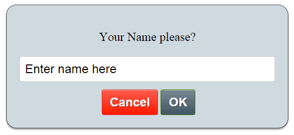

# Handling Alerts in Selenium WebDriver

This document explains how to handle different types of JavaScript alerts in Selenium WebDriver.

---

## What is an Alert?

An alert is a pop-up window generated by the browser to display messages or receive input. It can be:
- **Simple Alert** – Informational message with an OK button.
- **Confirmation Alert** – Offers OK and Cancel buttons.
- **Prompt Alert** – Accepts user input before proceeding.

 Simple Alert
- 
- Confirmation Alert
- 
- Prompt Alert
- 

---

## 1. Switching to an Alert

Before interacting with an alert, you must switch the driver's focus:

```java
Alert alert = driver.switchTo().alert();
```

---

## 2. Accepting an Alert (Click OK)

```java
Alert alert = driver.switchTo().alert();
alert.accept();
```

---

## 3. Dismissing an Alert (Click Cancel)

```java
Alert alert = driver.switchTo().alert();
alert.dismiss();
```

---

## 4. Reading Alert Text

```java
Alert alert = driver.switchTo().alert();
String alertMessage = alert.getText();
System.out.println("Alert says: " + alertMessage);
```

---

## 5. Sending Input to Prompt Alert

```java
Alert alert = driver.switchTo().alert();
alert.sendKeys("Test input");
alert.accept();
```

---

## Example: Handling All Alert Types

```java
public void handleAlerts() {
    // Trigger the alert (depends on app)
    driver.findElement(By.id("triggerAlert")).click();

    Alert alert = driver.switchTo().alert();
    System.out.println("Alert text: " + alert.getText());

    // Accept alert
    alert.accept();

    // Confirmation alert
    driver.findElement(By.id("confirmAlert")).click();
    driver.switchTo().alert().dismiss(); // or accept()

    // Prompt alert
    driver.findElement(By.id("promptAlert")).click();
    Alert prompt = driver.switchTo().alert();
    prompt.sendKeys("example@domain.com");
    prompt.accept();
}
```

---

## Common Issues

- **UnhandledAlertException**: Alert must be handled before proceeding.
- **NoAlertPresentException**: Ensure the alert is triggered before switching.
- Use explicit wait if alert takes time to appear:
```java
new WebDriverWait(driver, Duration.ofSeconds(5))
    .until(ExpectedConditions.alertIsPresent());
```

---

## Summary Table

| Action           | Method                              |
|------------------|--------------------------------------|
| Accept alert     | `alert.accept()`                    |
| Dismiss alert    | `alert.dismiss()`                   |
| Read alert text  | `alert.getText()`                   |
| Send input       | `alert.sendKeys("text")`           |
| Wait for alert   | `ExpectedConditions.alertIsPresent()` |

