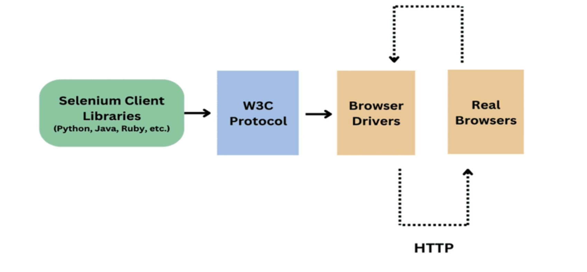

## WebDriver Interface and Browser Drivers in Selenium


---

**1. What is Interface in Java?**

- An interface is a collection of related methods with empty bodies (no implementation).
- It is the responsibility of a class to implement the methods declared in the interface.
- When a class agrees to implement an interface, it must provide implementation for all defined methods.
- In simple terms: ➔ An interface enforces a contract that the class must follow.

---

**2. What is WebDriver Interface?**

- WebDriver is an interface that provides a set of browser automation methods with empty bodies (abstract methods).
- Browser-specific classes like:
  - `ChromeDriver`
  - `FirefoxDriver`
  - `EdgeDriver`
  - `SafariDriver`

implement the `WebDriver` interface and provide their own implementations of the methods.

---

**How WebDriver, Browser Drivers, and Browser Work Together**

**1. WebDriver Client**

- The WebDriver client translates commands from your Selenium script into HTTP requests following the **W3C WebDriver Protocol**.

**Why W3C WebDriver Protocol?**
- All modern browsers (Chrome, Firefox, Safari, Edge) natively support the W3C protocol.
- Ensures consistent behavior across different browsers.

---

**2. Browser Driver**

**What is a Browser Driver?**
- Each browser (Chrome, Firefox, Safari, etc.) has its own dedicated driver program.
- This driver acts as a translator between WebDriver protocol (HTTP requests) and the actual browser.

**How it works:**
1. Your test script sends HTTP commands to the browser driver.
2. The browser driver translates those commands into native actions.
3. The browser executes the commands (open page, click, fill form, etc.).
4. The browser sends a response back to the browser driver.
5. The browser driver sends the response back to the WebDriver client.

---

**Creating Driver Objects**

**1. ChromeDriver Object**
```java
ChromeDriver driver = new ChromeDriver();
```
- The `driver` object has access to all the methods of the `ChromeDriver` class.

**2. WebDriver Interface Reference**
```java
WebDriver driver = new ChromeDriver();
```
- The `driver` reference only allows access to methods defined in the `WebDriver` interface.
- Even though the object is of `ChromeDriver`, it is referenced using the `WebDriver` interface.

---

**Summary**

| Topic             | Explanation                                               |
|-------------------|-----------------------------------------------------------|
| Interface in Java | Defines abstract methods implemented by classes           |
| WebDriver         | Interface for browser automation                         |
| Browser Drivers   | Translate WebDriver commands to browser actions           |
| Object Creation   | Create driver objects to interact with browser            |

Let me know if you'd like a visual flowchart or sample browser-driver interaction log added.
